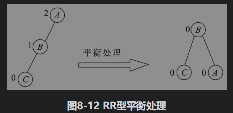
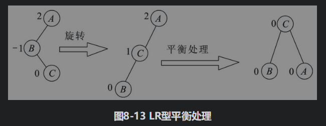
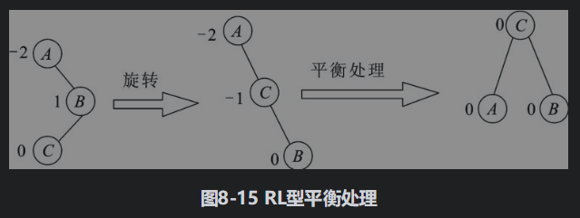

# tree 数据结构

# 树

```
树的术语概念

节点: 节点包含数据元素及若干指向子树的分支信息. 
节点的度: 节点拥有的子树个数. 
树的度: 树中节点的最大度数. 
终端节点: 度为0的节点，又称为叶子. 
分支节点: 度大于0的节点. 除了叶子都是分支节点. 
内部节点: 除了树根和叶子都是内部节点. 
```

# B树

```
红黑树和B树中的3阶4阶B树等价, 这里介绍B树有助于了解红黑树
```


## 定义

```
B树 (平衡树, 包括2叉树和多叉树)
    多路平衡搜索树, 又称为B-树, 或者B树. 一棵m阶B-树, 或为空树, 或满足以下特性. 
    1. 每个节点最多有m棵子树. 
    2. 根节点至少有两棵子树. 
    3. 内部节点(除根和叶子之外的节点)至少有floor(m/2)棵子树. 
    4. 终端节点(叶子)在同一层上, 并且不带信息(空指针), 通常称为失败节点. 
    5. 非终端节点的关键字个数比子树个数少1. 
    也就是说, 根节点至少有一个关键字和两棵子树, 其他非终端节点关键字个数范围为[floor(m/2)-1, m-1], 子树个数范围为[floor(m/2), m]. 

说明:
    1. B-树具有平衡/有序/多路的特点. 在B-树中, 所有的叶子都在最后一层, 因此左右子树的高差为0, 体现了平衡的特性. B-树具有中序有序的特性, 即左子树<根<右子树. 多路是指可以有多个分支, m阶B-树中的节点最多可以有m个分支, 所以称为m路平衡搜索树. 
    2. 层和节点的关系: h+1层至少有2*floor(m/2)^(h-1)个节点
    3. B树所有叶子到根节点的高度都相同
    4. 节点可以存储多个key, 多个key可以由链表存储, 也可以有数组存储
    5, 新添加的元素必须添加到叶子结点
    6. 应用, 多用于文件索引, 多大成百上千阶

阶数m: m阶B树
    根节点中key的数量x, 1 <= x <= m-1
    非根节点中key的数量x, floor(m/2)-1 <= x <= m-1
    页子节点数量y, y = x+1
    以2-3树为例, 非叶子结点和其子节点的关系, 
        要么 1个父节点(1个key)带2个子节点
        要么 1个父节点(2个key)带3个子节点
        
    m=2, 每个节点最多1个值, 最多2个子节点, 也就是普通二叉树
    m=3, 每个节点最多2个值, 最多3个子节点, 就是23树
    m=4, 每个节点最多3个值, 最多4个子节点, 就是234树, 简称24树

性能分析
    1. 单个节点内最多有m-1个key, 搜索到这些key, 可以通过遍历或者二分法, 由于都是内存操作, 所以通常复杂度忽略不计
    2. 复杂度仅仅与树的高度和阶数有关, O(log_mN), 当m=2(2阶), 复杂度=O(logN)
    3. 插入复杂度: O(log_mN)

调整
    1. 上溢
        当节点key>m-1, 则需要分裂节点并将某个key上溢, 直到满足 key<=m-1
        1) 上溢到根节点如果还需要上溢, 则树的整体高度会增高, 且只有这种方式能让B树增高
    2. 下溢
        非叶子结点子节点<=x, 则需要将父节点分裂并下溢, 直到满足  y = x+1
        1) 如果父节点直到根节点都不够下溢, 则会出现父子节点合并, 从而B树的高度降低, 且只有这种方式能让B树降低
    3. 上溢或者下溢过程中, 为了满足B的有序性, 可能会出现(当前节点/父节点/兄弟节点)相互交换的情况, 这其实就等价于二叉树的旋转

```

## 特点

```

```

## 对应数据结构

```

```

## 运算

```

```

### 添加修正-上溢

```
上溢: 
    1. 节点从中间分裂, (如果是奇数, 那么从中间靠左靠右都可以)
    2. 将节点中间(中间某一个)key上升并合并到父节点中
触发条件:
    1. 新增节点key, 如果节点key数量到达阈值(最大 m-1), 就会发生上溢
上溢情况: 
    1. 单纯上溢, 上溢情况只有一种, 即使出现连锁上溢或者高度降低, 那同样也是上溢
    2. 连锁单纯上溢
特殊说明: 
    1. 上溢后的父节点key数量也可能会达到阈值, 从而发生连锁上溢现象, 
    2. 当上溢到根节点, 而根节点key数量也达到了阈值的时候, 那么根节点也会上溢最终可能导致B树高度+1
    3. 注意: 上溢的过程中, 不会因为兄弟节点key数量不足, 从而调整节点结构来降低(不增高)高度
```

**总结**

```
4阶B树为例

修正上溢(只有1种情况)

1. 新增key, 如果所在节点key数量=4时, 
                则 1)当前节点从中间分裂, 2)中间左key上溢, 升级到父节点中, 与父节点合并(如果父节点不存在则变成新的父节点)

```

**图解说明**

1. 达到阈值上溢, 节点的 key>=3 需要上溢
    

2. 父节点达到阈值连锁上溢, 如果上溢后, 父节点 key>=3, 则也会触发父节点上溢
    
    

3. 根节点达到阈值, 发生上溢可能会触发连锁反应, 一直上溢到根节点, 而根节点也可能会触发上溢, 从而增高B树的高度
    
    
    

4. 注意: 以3为例, 37上溢到和45,50在一起, 而并没有将(37,45,50)下陈到与其他子节点合并在一起, 从而降低自己的阈值(就不会增高B数的高度了), 

### 删除修正-下溢

```
下溢: 下溢的情况比较多
触发条件:
    1. 如果节点key数量到达阈值(最小 1), 就会发生下溢
下溢的各种情况
    1. 单纯下溢
        1. 删除当前节点, 将父节点直接前/后驱key替代当前删除的节点
        2. key下溢后和兄弟节点合并成一个节点
    2. 连锁单纯下溢, 父节点不够导致合并, 高度降低
        1. 和1.1相同, 但是父节点中只有一个key, 下溢后该父节点为空(等价于删除)
        2. 此时出现连锁下溢的情况, 向父父节点继续下溢
    3. 下溢左借(如果连锁左借, 则发生右旋)
        1. 删除当前节点, 将子节点直接前驱key替代当前删除的节点
        2. 此时, 如果子节点只有一个key, 就会导致子节点数量降低, 从而需要向左兄弟节点借一个key(右旋)
    4. 下溢右借(如果连锁右借, 则发生左旋)
        和3相反
```

**总结**

```
4阶B树为例

修正下溢


1. 删除叶子节点s-key, 如果该节点key数量=1时, 
            下溢
            则 到父节点中找到s-key直接前驱p-key, 将其分裂出来, 并和p-key直接前驱的节点(在子节点中, 也就是s-key的兄弟节点)合并
2. 删除叶子节点s-key, 如果该节点key数量=1时, 
            连锁下溢
            则 到父节点中找到s-key直接前驱p-key, 将其分裂出来, 并和p-key直接前驱的节点(在子节点中, 也就是s-key的兄弟节点)合并
            如果父节点中只有一个key, 此时相当于父节点中的key也被删除, 则继续下溢
3. 删除非叶子节点s-key, 如果该节点key数量!=该节点子节点数量-1时
            下溢+左借右旋
            则 到子节点中找到s-key直接前驱p-key, 将其分裂出来, 并和s-key所在的节点合并(替代s-key的位置)
            如果p-key所在节点只有1个key, 此时s-key所在节点的子节点数量-1了(不符合), 则需要向p-key左兄弟节点借一个key
                左借: <p-key>-<pp-key>-<ppp-key> 相当于右旋
                    <pp-key>是<p-key>的直接前驱key, 在<p-key>父节点中, 在<s-key>所在节点中
                    <ppp-key>是<pp-key>的直接前驱key, 在<s-key>所在节点的子节点中
4. 删除非叶子节点s-key, 如果该节点key数量!=该节点子节点数量-1时
           下溢+右借左旋
           则 到子节点中找到s-key直接后驱p-key, 将其分裂出来, 并和s-key所在的节点合并(替代s-key的位置)
           如果p-key所在节点只有1个key, 此时s-key所在节点的子节点数量-1了(不符合), 则需要向p-key右兄弟节点借一个key
               右借: <p-key>-<pp-key>-<ppp-key> 相当于左旋
                   <pp-key>是<p-key>的直接后驱key, 在<p-key>父节点中, 在<s-key>所在节点中
                   <ppp-key>是<pp-key>的直接后驱key, 在<s-key>所在节点的子节点中
```

**图解说明**

1. 纯下溢
    
    

2. 连锁单纯下溢, 下溢并合并
    
    
    

3. 下溢左借(发生右旋)
    
    

4. 下溢右借(发生左旋)
    
    

## 存储结构

```

```

# 二叉树

```
二叉树是阶为2的B树
```

## 二叉树的分类

```markdown
按照结构

> 完全二叉树: 节点由上到下, 由左向右依次排布, 
    存储方式可以使用数组或者链表, 
    如果使用数组, 
        1. 可以通过公式明确的知道父子节点索引的关系, 并快速定位到相应节点
        2. 如果节点中没有空元素, 则顺序存储在数组中能节省空间, 也是完全二叉树建议的存储方式
    如果使用链表, 
        1. 只能通过遍历的方式找到父子节点
        2. 如果节点中有空元素(这样的话就不算是完全二叉树了), 使用链表的方式比较节省空间
    > 满二叉树: 特殊的完全二叉树, 每层节点数都是满的
> 哈夫曼树(最优二叉树)

按照是否有序和平衡性

> 普通二叉树
> 二叉搜索树(有序)BST
    > 平衡二叉树AVL
        > 红黑树RB
```

## BST二叉搜索树

## AVL自平衡二叉树

```
AVL平衡二叉树
也就是说, 一棵二叉排序树中, 所有结点的平衡因子只为0、1、-1时, 则该二叉排序树就是一棵平衡二叉树, 否则就不是一棵平衡二叉树. 
也可以这样理解: 平衡二叉树或者是一棵空树, 或者是具有下列性质的二叉排序树. 
1. 它的左子树和右子树高度之差的绝对值不超过1. 
2. 它的左子树和右子树都是平衡二叉树. 
```
### 平衡过程








## 红黑树

### 定义

```
红黑树定义
    1. 每个节点是红色或黑色的. 
    2. 根节点是黑色的. 
    3. 每个叶子节点是黑色的, 空子节点默认为黑色. 
    4. 如果一个节点为红色, 则其孩子节点必为黑色. 
    5. 从任一节点到其后代叶子的路径上, 均包含相同数目的黑节点. 

```

### 特点

```
红黑树 1972年由Rudolf Bayer发明的
左倾红黑树 2008年 Robert Sedgewick 对其进行了改进, 并命名为 LLRBT(Left-leaning Red Black Tree 左倾红黑树). 
左倾红黑树相比1978年的红黑树要简单很多, 实现的代码量也少很多. Robert Sedgewick也是Algorithms(中文版叫《算法》)这本书的作者
```

### 对应数据结构

```
1. 左倾红黑树
2. 传统红黑树
```

### 运算

```

```

#### 新增修正

**总结**

```
需要修正, <新>=红色, <父>=红, 双红需要修正
1. <叔>=红
    修正: 仅仅变色 
        1. <父><叔>变黑
        2. <祖>变红 (如果<祖>不是root)
2. <叔>=黑
    修正: 旋转+变色
    1. 旋转: 如果(<祖>-<父>-<新>)      
                    是RL, 则<父>右旋成RR, 
                    是RR, 则<祖>左旋;     变色: 原<祖>变红(新<兄>), 原<新>变黑(新<父>)
    2. 旋转: 如果(<祖>-<父>-<新>)
                    是RR, 则<祖>左旋;     变色: 原<祖>变红(新<兄>), 原<新>变黑(新<父>)
    3. 旋转: 如果(<祖>-<父>-<新>)
                    是LR, 则<父>左旋成LL, 
                    是LL, 则<祖>右旋;     变色: 原<祖>变红(新<兄>), 原<新>变黑(新<父>)
    4. 旋转: 如果(<祖>-<父>-<新>)是LL, 
                    是LL, 则<祖>右旋;     变色: 原<祖>变红(新<兄>), 原<新>变黑(新<父>)  

```

**图解说明**

1.  叔=红, 仅仅变色
    

2.  叔=黑, 旋转+变色, 这里仅展示1种其他类似
    


#### 删除修正

**总结**

```
 需要修正, <删>=黑色, 删除的节点为黑色需要修正
1. <子>=红
    修正: 仅仅变色
        变色: <子>变黑, 直接前/后驱子节点替代父节点
2. <子>=黑, 为null也表示为黑
    修正: 旋转+变色
    1. 如果<删的兄>为黑色, <删的兄>有红色子节点<兄的子>
        旋转: 判断路径 <删的父>-<删的兄>-<兄的子>, 进行旋转
        变色: 原来<删的父>不变, 原来<删的父>两个子节点变红?
    2. 如果<删的兄>为黑色, <删的兄>无红色子节点, <删的父>为红色
        变色: <删的兄>和<删的父>换色
    3. 如果<删的兄>为黑色, <删的兄>无红色子节点, <删的父>为黑色
        变色: <删的兄>变为红色, 等价<删的父>删除, 继续修正
    4. 如果<删的兄>为红色
        旋转: 旋转, <删的父>-<删的兄> 左旋或者右旋
        变色: <删的兄>和<删的父>换色
        继续修正

```

**图解说明**

1. <删>=黑色, <子>=红, 仅仅变色
    
    

2. <删>=黑色, <子>=黑
2.1. 如果<删的兄>为黑色, <删的兄>有红色子节点<兄的子>
    
    

2.2. 如果<删的兄>为黑色, <删的兄>无红色子节点, <删的父>为红色
    
    

2.3. 如果<删的兄>为黑色, <删的兄>无红色子节点, <删的父>为黑色
    

2.4. 如果<删的兄>为红色
    

### 存储结构

```

```


